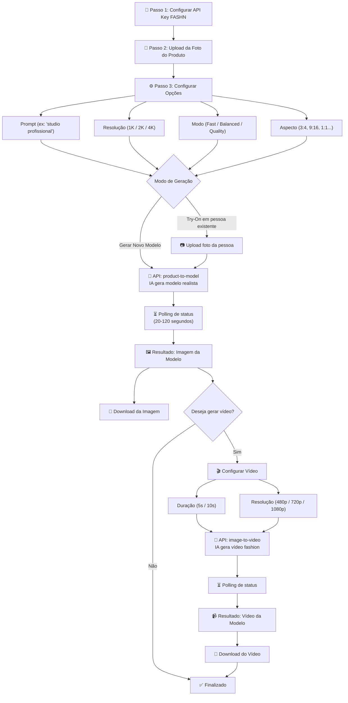

# AI Fashion Studio — Plano de Implementação + Custos

Aplicação web que permite ao usuário enviar a foto de um produto (roupa, acessório, etc.), colocá-lo em uma modelo virtual realista gerada por IA, e opcionalmente gerar um vídeo curto da modelo vestindo/mostrando o produto.

---

## 💰 Tabela de Custos — API FASHN.ai

> **Valor base on-demand: US$ 0,075 por crédito** (mínimo de compra: US$ 7,50 = 100 créditos)
> 
> Conta gratuita inclui **10 créditos** para teste inicial.

### Custo por Geração de Imagem (Product to Model)

| Modo de Geração | 1K (~1MP) | 2K (~4MP) | 4K (~16MP) |
|:---|:---:|:---:|:---:|
| **Fast** | 1 crédito (US$ 0,08) | 2 créditos (US$ 0,15) | 3 créditos (US$ 0,23) |
| **Balanced** | 2 créditos (US$ 0,15) | 3 créditos (US$ 0,23) | 4 créditos (US$ 0,30) |
| **Quality** | 3 créditos (US$ 0,23) | 4 créditos (US$ 0,30) | 5 créditos (US$ 0,38) |

> [!NOTE]
> Adicionar **Face Reference** (usar rosto específico) custa **+3 créditos** por imagem.

### Custo por Geração de Vídeo (Image to Video)

| Duração | 480p | 720p | 1080p |
|:---|:---:|:---:|:---:|
| **5 segundos** | 1 crédito (US$ 0,08) | 3 créditos (US$ 0,23) | 6 créditos (US$ 0,45) |
| **10 segundos** | 2 créditos (US$ 0,15) | 6 créditos (US$ 0,45) | 12 créditos (US$ 0,90) |

### Cenários de Uso Estimados

| Cenário | Operações | Créditos | Custo (US$) |
|:---|:---|:---:|:---:|
| **Só foto no modelo** (1K Fast) | 1× Product-to-Model | 1 | US$ 0,08 |
| **Foto + Vídeo curto** (1K Fast + 720p 5s) | 1× Imagem + 1× Vídeo | 4 | US$ 0,30 |
| **Foto HD + Vídeo Full HD** (2K Balanced + 1080p 10s) | 1× Imagem + 1× Vídeo | 15 | US$ 1,13 |
| **100 produtos (lote básico)** | 100× Product-to-Model 1K Fast | 100 | US$ 7,50 |
| **100 produtos + vídeos** | 100× Imagem + 100× Vídeo 720p 5s | 400 | US$ 30,00 |

### Planos de Volume (desconto)

| Plano | Créditos/mês | Custo/crédito | Custo mensal |
|:---|:---:|:---:|:---:|
| **On-Demand** | Sem limite | US$ 0,075 | Pago por uso |
| **Alto Volume** (negociação) | — | ~US$ 0,04 | Sob consulta |

---

## Fluxo do Usuário



---

## Arquitetura Técnica

### Stack
- **Frontend**: HTML + CSS + JavaScript puro (sem framework)
- **API**: FASHN.ai REST API (chamadas diretas do browser)
- **Storage**: `localStorage` para API key
- **Design**: Dark mode, glassmorphism, Google Fonts (Inter)

### Arquivos

| Arquivo | Descrição |
|:---|:---|
| `index.html` | Estrutura da página com wizard de 4 etapas |
| `style.css` | Design system premium dark mode com animações |
| `app.js` | Lógica de upload, chamadas API, polling e download |

### Integração com API

```
POST https://api.fashn.ai/v1/run     → Inicia geração (retorna ID)
GET  https://api.fashn.ai/v1/status/{id}  → Polling até "completed"
```

---

## Verification Plan

### Testes no Browser
- Verificar todas as interações visuais e responsividade
- Testar error handling com API key inválida
- Validar fluxo completo de upload → resultado → download

### Teste Real
- Usuário insere API key FASHN e testa com foto de produto real
